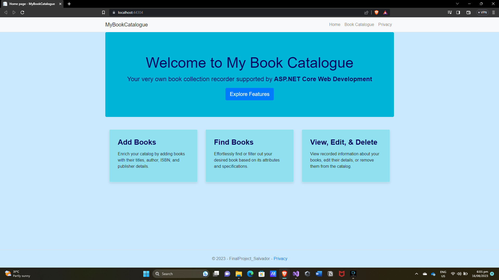
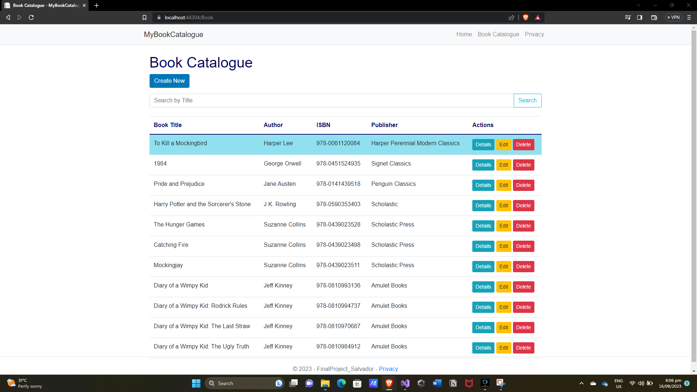
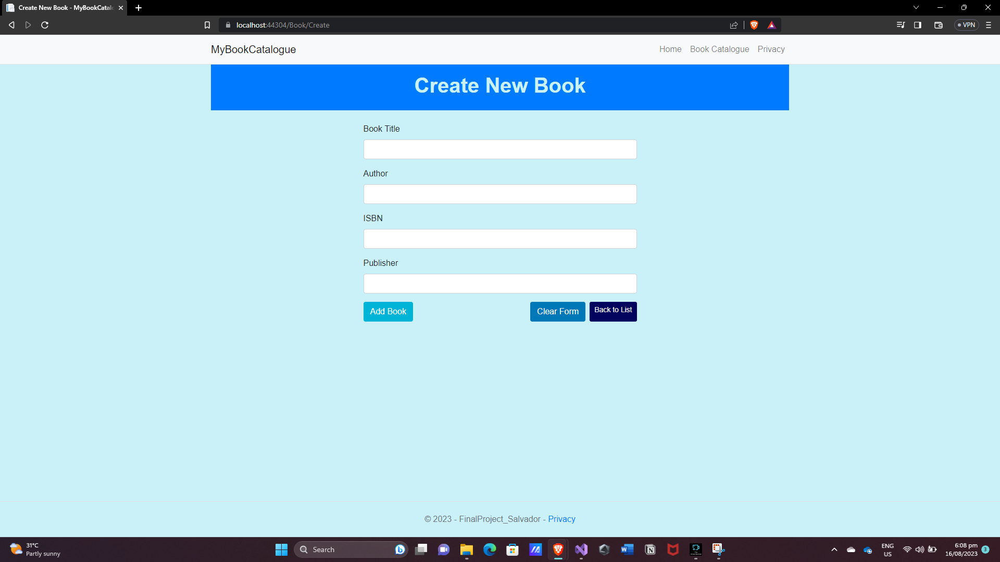
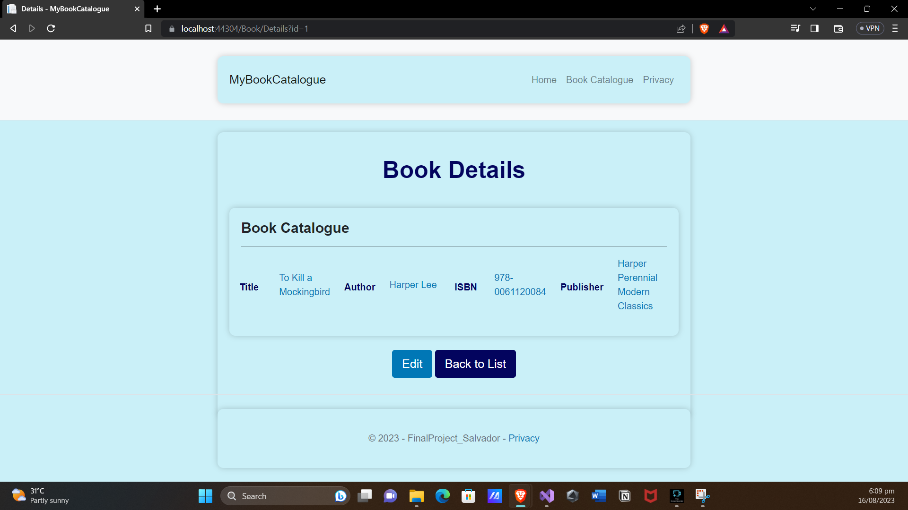
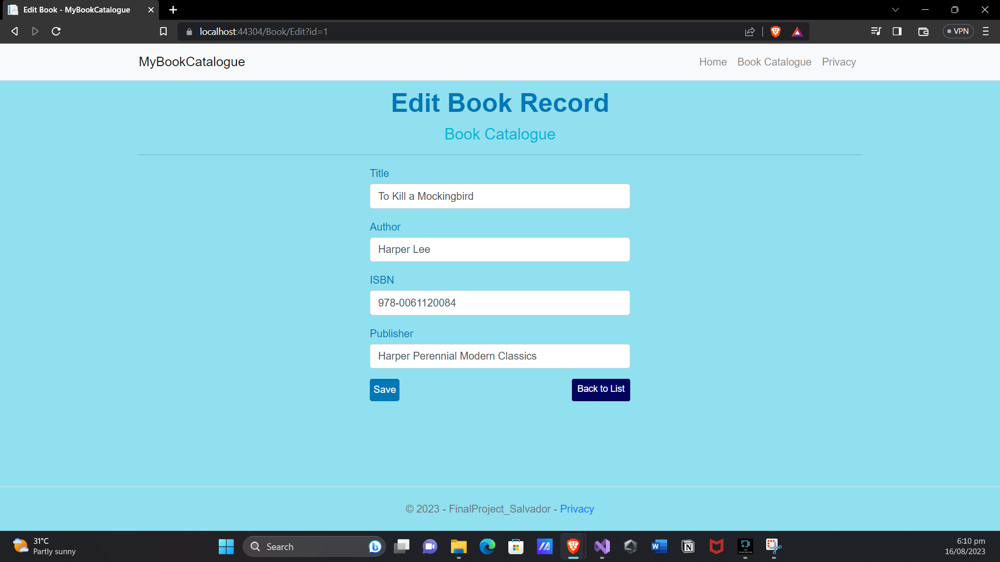
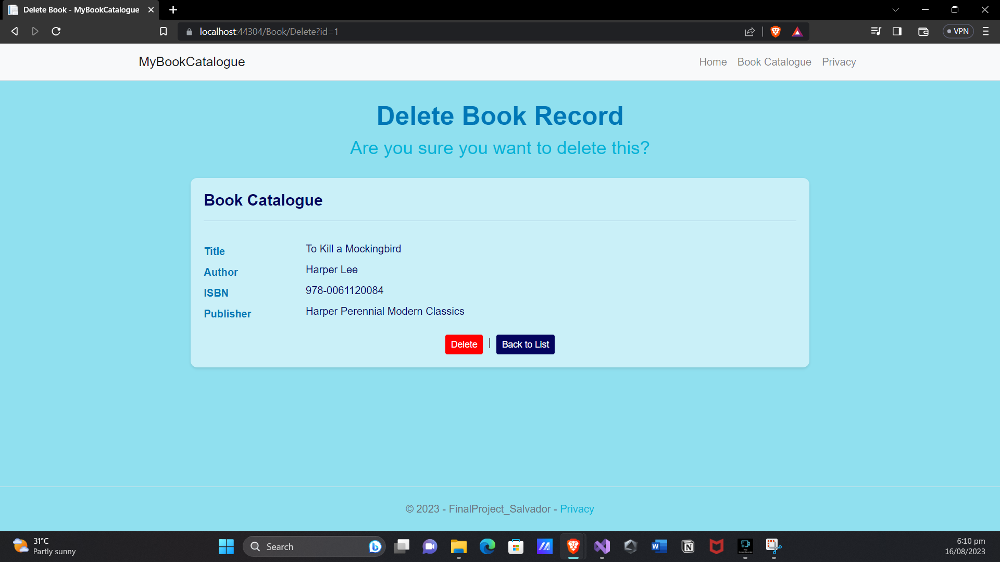
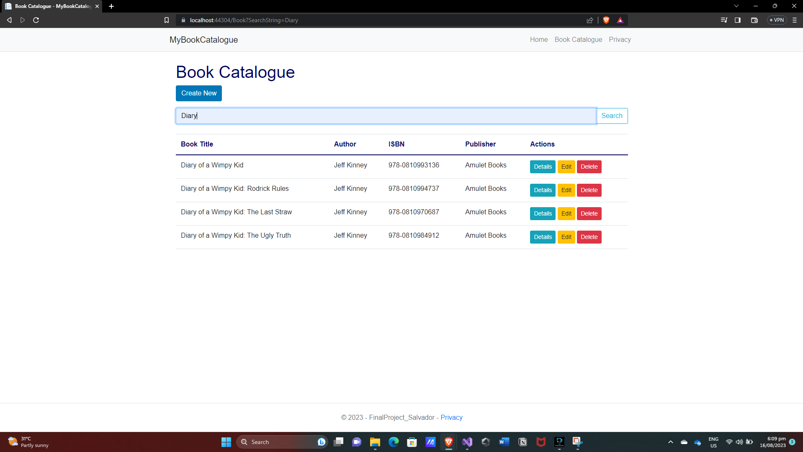
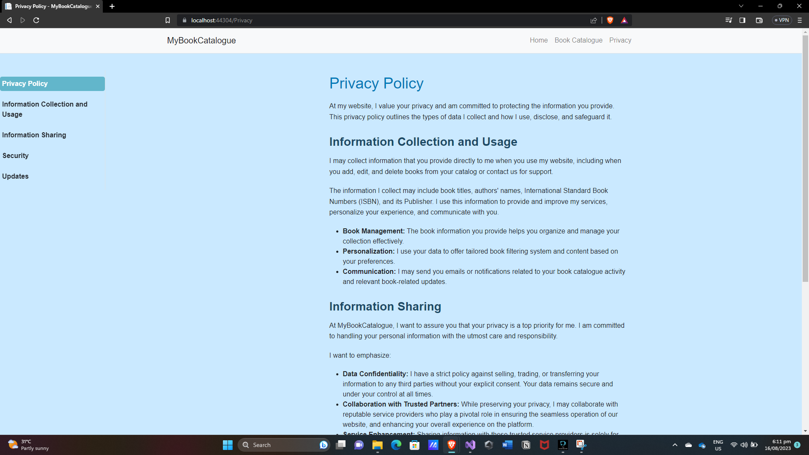

# My Book Catalogue

A simple and user-friendly web application using ASP.NET Core, HTML, CSS, and C# that allows users to catalog their personal book collection. This includes features like viewing, adding, editing, deleting, and filtering/searching through books.

## Screenshots

| Page | Screenshot |
|------|------------|
| Home Page |  |
| Book Catalogue Index |  |
| Create Book Entry |  |
| View Book Details |  |
| Edit Book Entry |  |
| Delete Book Entry |  |
| Filter and Search Books |  |
| Privacy Policy |  |

